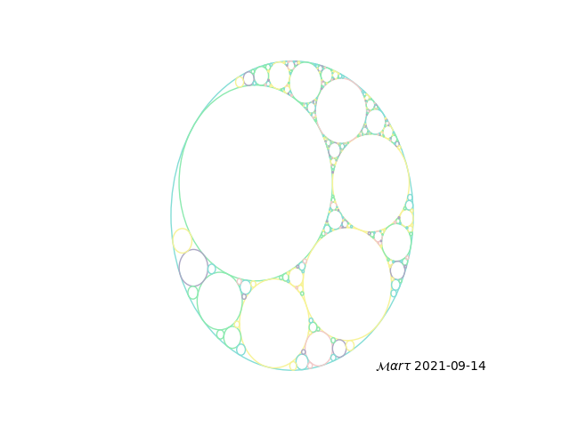
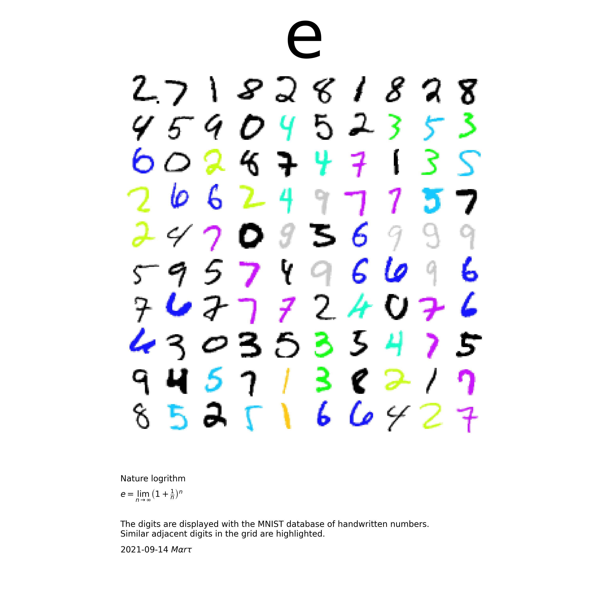
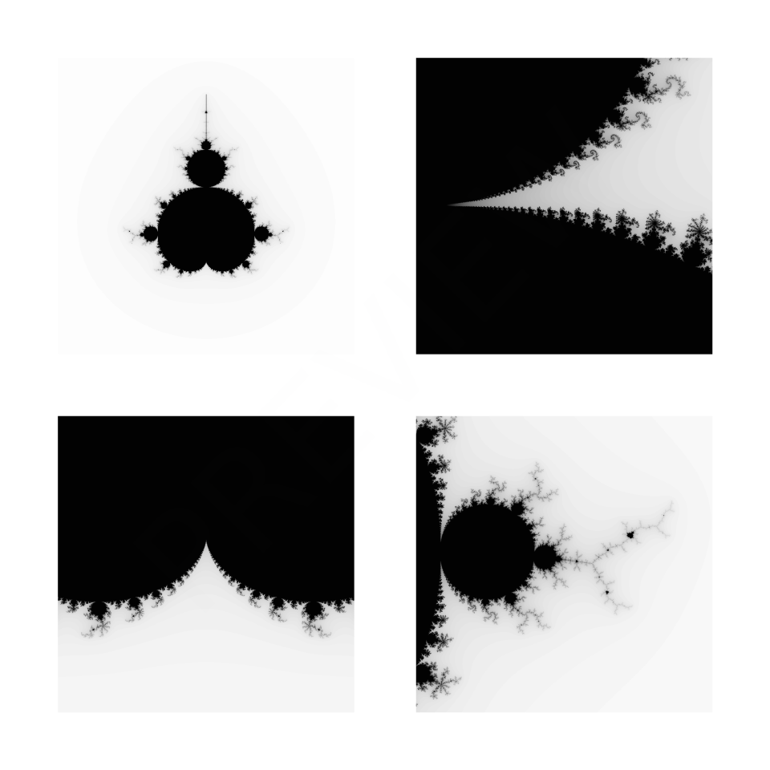
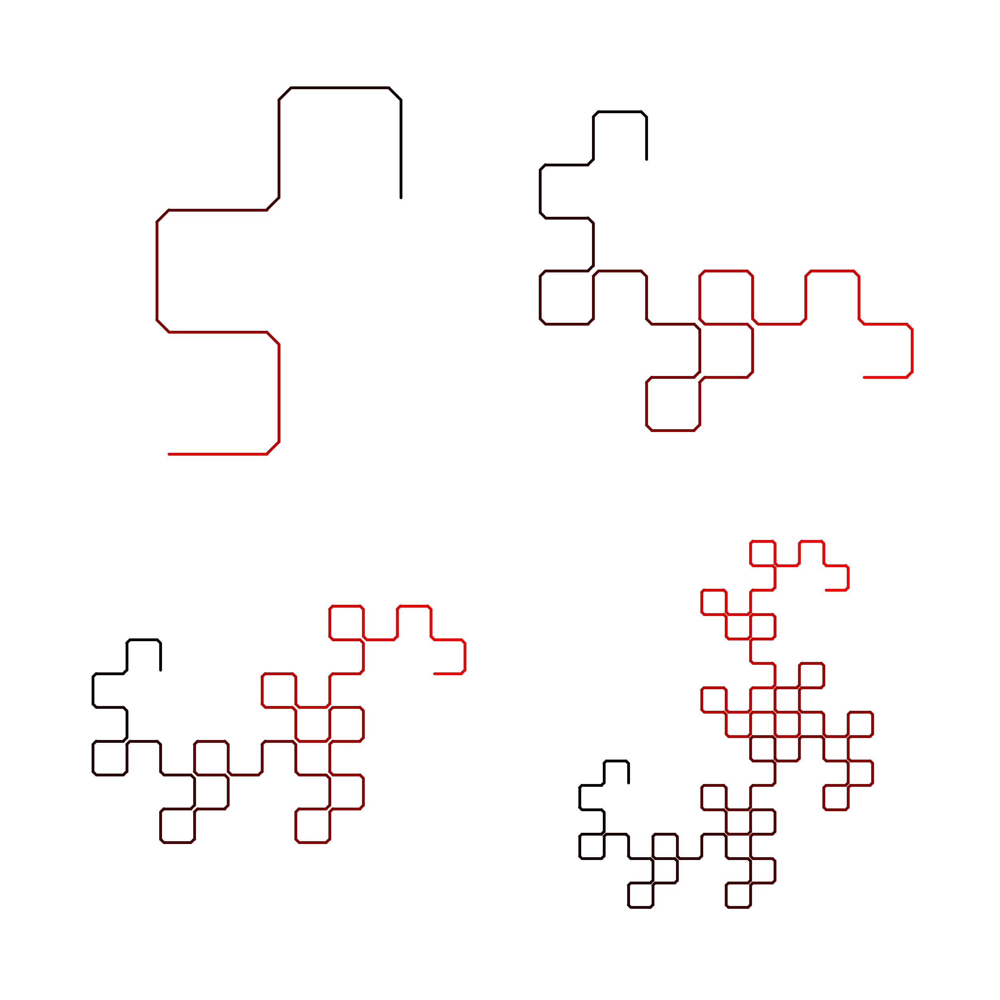
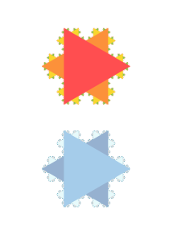
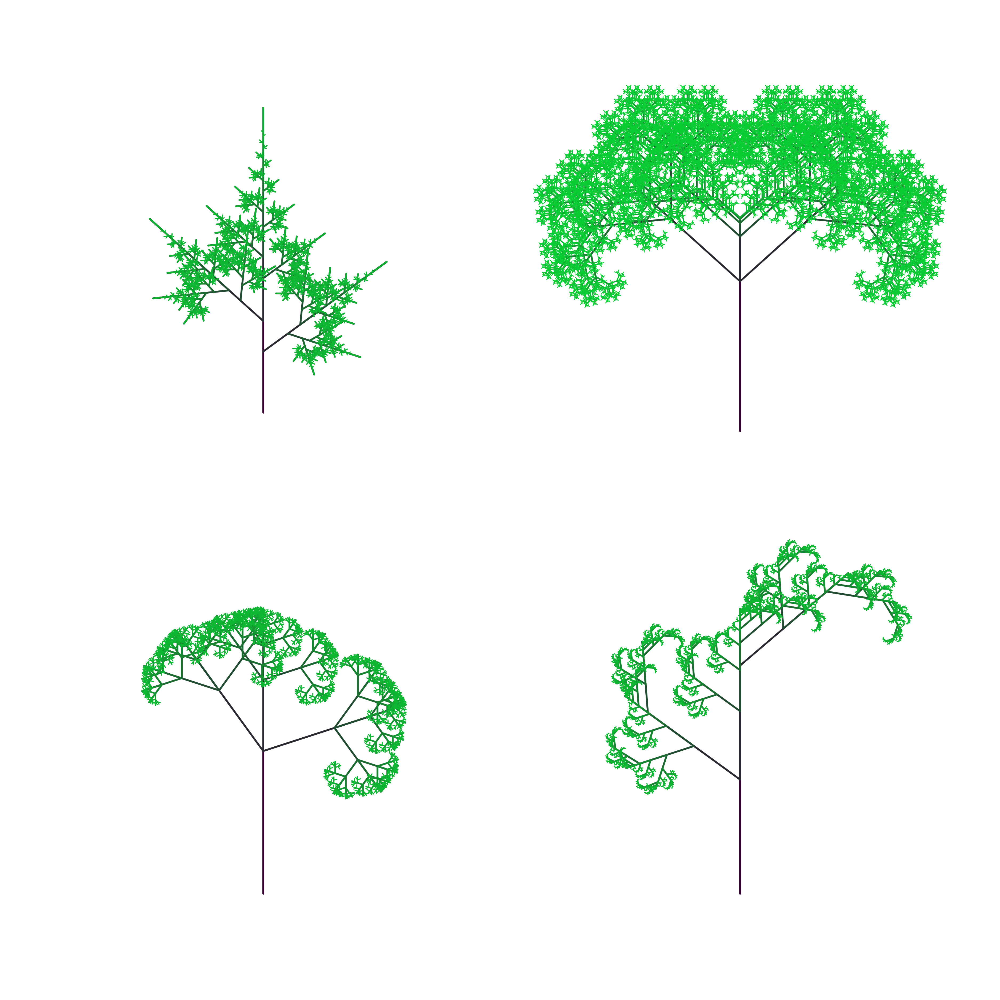

# Mart

Mathematical art = Mart

Here is some 'python' code to create mathematical art. 

Its not particular well written was made roughly in 2017 ish. 

# circles

# digits

Fun with the MNist data set

# mandelbrot

Fun with Mandelbrot set

# paper

Fun with Dragon fractal

# squares and triangles

# tree

# website

Simple django app for the website (no longer running)